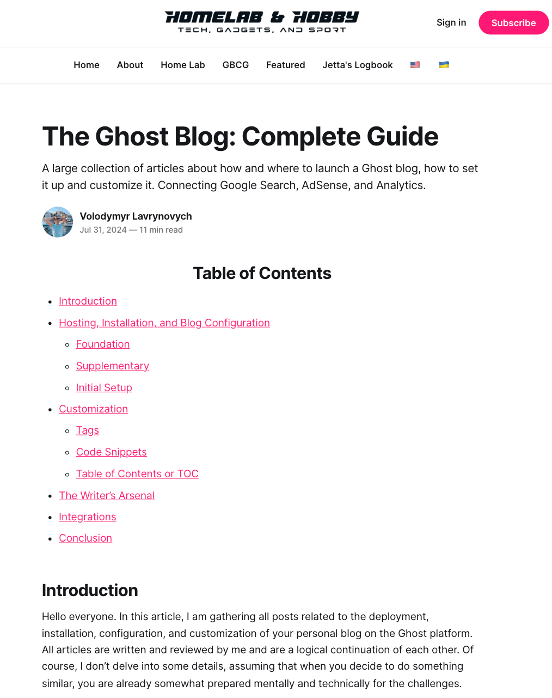

# Ghost TOC

A lightweight, customizable Table of Contents generator for Ghost blog platform.

> **Note**: While designed specifically for Ghost, this script will work on any webpage that has an `<article>` tag containing heading elements (H2-H6). The Ghost-specific features include filtering out Ghost's author name heading and integration with Ghost's code injection system.

## Preview

|  | **See it in action**<br><br>Ghost TOC automatically generates a hierarchical table of contents from your article headings.<br><br>**Features shown:**<br>• Clean, minimal design<br>• Hierarchical structure (H2, H3)<br>• Clickable navigation links<br>• Customizable title |
|-----|-----|

## Features

- 🚀 Automatic TOC generation from article headings (H2-H6)
- 🎨 Customizable styling with border and background colors
- 📱 Collapsible functionality with show/hide toggle
- 🔗 Smooth anchor navigation
- 💪 Zero dependencies
- 📦 Lightweight (~2KB minified)
- 🌍 Multi-language support via customizable title attribute
- 🔄 Single point of maintenance - update once, apply everywhere
- 💾 Reduces database size - no script duplication across posts

## Installation

### Using Code Injection (Recommended)

1. Go to your Ghost Admin panel
2. Navigate to **Settings** → **Code Injection**
3. In the **Site Footer** section, copy and paste the content from `dist/ghost-toc.min.js`
4. Click **Save**

### Manual Installation

Download the `dist/ghost-toc.min.js` file and include it in your Ghost theme's footer.

**📖 For detailed installation instructions with pro tips, see [INSTALLATION.md](docs/INSTALLATION.md)**

**⚡ Want to get started quickly? Check out the [Quick Start Guide](docs/QUICK-START.md)**

## Usage

### Basic Usage

Add the `<toc>` tag anywhere in your Ghost article where you want the table of contents to appear:

```html
<toc title="Table of Contents"></toc>
```

### Collapsible TOC

Create a collapsible table of contents with custom styling:

```html
<toc
  title="Table of Contents"
  collapsible="true"
  show-text="Show"
  hide-text="Hide"
  border-color="gainsboro"
  bg-color="aliceblue">
</toc>
```

## Configuration Options

| Attribute | Type | Default | Description |
|-----------|------|---------|-------------|
| `title` | string | - | Title displayed at the top of TOC |
| `collapsible` | boolean | `false` | Enable collapsible functionality |
| `show-text` | string | `"Show"` | Text for expand button |
| `hide-text` | string | `"Hide"` | Text for collapse button |
| `border-color` | string | `"gainsboro"` | Border color for collapsible TOC |
| `bg-color` | string | `"aliceblue"` | Background color for collapsible TOC |

**🎨 Want more customization options? See the [Customization Guide](docs/CUSTOMIZATION.md)**

## How It Works

Ghost TOC automatically:
1. Scans your article for heading elements (H2-H6)
2. Filters out Ghost's default author name heading
3. Builds a hierarchical navigation structure
4. Generates clickable links with anchor navigation
5. Applies custom styling based on your configuration

## Examples

See the `examples/` directory for complete implementation examples:
- [Basic Example](examples/basic-example.html) - Simple TOC with title
- [Collapsible Example](examples/collapsible-example.html) - Advanced TOC with collapse functionality
- [Full Customization Example](examples/full-customization-example.html) - Complete example using all available configuration options

## Why Use Ghost TOC?

### Traditional Approach Problems
- ❌ Script duplicated in every single post
- ❌ Database bloat from repeated code
- ❌ Updating requires editing all posts manually
- ❌ Inconsistent behavior across posts

### Ghost TOC Benefits
- ✅ **One-Time Setup**: Install script once in footer, use everywhere
- ✅ **Database Efficient**: Only a small `<toc>` tag per post
- ✅ **Easy Updates**: Change footer script, all posts update automatically
- ✅ **Consistent Experience**: Same behavior across your entire blog
- ✅ **Multi-language Ready**: Different titles for different language versions

## Real-World Use Cases

### Technical Blogs
Long tutorials and documentation benefit from hierarchical navigation through complex topics.

### Multi-language Sites
Easily customize TOC titles per language without maintaining separate scripts:
```html
<!-- English post -->
<toc title="Table of Contents"></toc>

<!-- Spanish post -->
<toc title="Tabla de Contenidos"></toc>
```

### Long-form Content
Articles with multiple sections become more navigable and user-friendly.

### Documentation Sites
Perfect for Ghost-powered documentation with structured content.

## The Story Behind Ghost TOC

Ghost TOC was born from a simple frustration: **Ghost didn't have built-in table of contents functionality**, and the existing solutions weren't good enough.

### The Problem (2024)

When writing comprehensive articles, I needed a way to help readers navigate through sections. Manual TOCs were tedious and error-prone—every time you changed a heading, you had to update the links. The recommended solution, Tocbot, had its own issues:

- Only worked in sidebars, limiting design flexibility
- Required loading external dependencies from CDNs
- Needed direct server file modifications (default.hbs, post.hbs) that many Ghost users couldn't access

There had to be a better way.

### Version 1.0 - The Beginning

The first version ([v1.0 Gist](https://gist.github.com/vlavrynovych/4111095383229db74e71aedf72652fc9), [blog post](https://lavr.site/en-table-of-contents-ghost/)) solved the core problem:

- ✅ Pure JavaScript—no external dependencies
- ✅ Works anywhere in your post, not just sidebars
- ✅ Installed via Ghost's Code Injection (no server access needed)
- ✅ Simple `<toc>` tag in your posts
- 📝 Supported H2 and H3 headings (2 levels)

But there was a catch: the script had to be duplicated in every single post. This meant database bloat and maintenance headaches when updates were needed.

### Version 2.0 - The Evolution

V2 ([v2.1 Gist](https://gist.github.com/vlavrynovych/3f244d0b7e9ea9a861d9427aa76486d1), [blog post](https://lavr.site/en-table-of-contents-ghost-v2/)) revolutionized the approach:

- 🔄 **One script in the footer, unlimited use in posts**—just add the `<toc>` tag where needed
- 📊 **Full heading hierarchy** (H2-H6) added in May 2024
- 📱 **Collapsible functionality** added in December 2024
- 🌍 **Multi-language support** through customizable titles
- 💾 **Database efficiency**—no more duplicated code

### Today - The Repository

What started as a Gist has grown into a full-fledged project with:

- 🏗️ Automated build system with minification
- 📚 Comprehensive documentation and examples
- 🎨 Advanced customization options
- 🌐 Compatibility beyond Ghost (works on any HTML page)

Ghost TOC proves that sometimes the best solutions come from scratching your own itch. What began as a simple workaround is now used by bloggers worldwide to make their content more navigable and user-friendly.

### Migration from Gist

If you're currently using the Gist version, simply replace it with the code from this repository's `dist/ghost-toc.min.js` file. The API and functionality remain the same - no changes needed to your `<toc>` tags!

## Using Outside of Ghost

While Ghost TOC is designed for the Ghost platform, it can be used on any website with the following requirements:

### Requirements
1. Your page must have an `<article>` tag containing your content
2. Headings must be properly structured (H2-H6) with `id` attributes for anchor links
3. Include the script before the closing `</body>` tag

### Generic HTML Usage

```html
<!DOCTYPE html>
<html>
<head>
    <title>My Article</title>
</head>
<body>
    <article>
        <toc title="Table of Contents"></toc>

        <h2 id="section-1">Section 1</h2>
        <p>Content here...</p>

        <h3 id="subsection-1-1">Subsection 1.1</h3>
        <p>More content...</p>

        <h2 id="section-2">Section 2</h2>
        <p>Content here...</p>
    </article>

    <script src="path/to/ghost-toc.js"></script>
</body>
</html>
```

### WordPress, Drupal, or Static Sites
Simply include the script in your theme's footer and add the `<toc>` tag where needed. Most modern CMS platforms automatically generate heading IDs, making this script compatible out of the box.

## Development

### Building from Source

To build the minified distribution file from source:

```bash
# Install dependencies
npm install

# Build minified version
npm run build
```

This will minify `src/ghost-toc.js` and output to `dist/ghost-toc.min.js`.

### Automated Workflows

GitHub Actions automatically handles builds:
- **Auto Build**: When you push changes to `src/`, the minified file is automatically rebuilt and committed
- **Release**: When you create a GitHub release, the minified file is automatically attached as a downloadable asset

See [`.github/workflows/README.md`](.github/workflows/README.md) for details.

For detailed build instructions, see [BUILD.md](BUILD.md).

### Project Structure

```
ghost-toc/
├── src/
│   └── ghost-toc.js              # Source code (edit this)
├── dist/
│   └── ghost-toc.min.js          # Minified distribution (auto-generated)
├── docs/                         # Documentation
├── examples/                     # Working examples
└── scripts/                      # Build scripts
```

## License & Credits

**License**: MIT License - see [LICENSE](LICENSE) file for details

**Author**: Volodymyr Lavrynovych

**Community**:
- [Ghost Forum Discussion](https://forum.ghost.org/t/ghost-toc-automatic-table-of-contents-for-your-posts/61558) - Share feedback and questions
- [GitHub Issues](https://github.com/vlavrynovych/ghost-toc/issues) - Report bugs or request features
